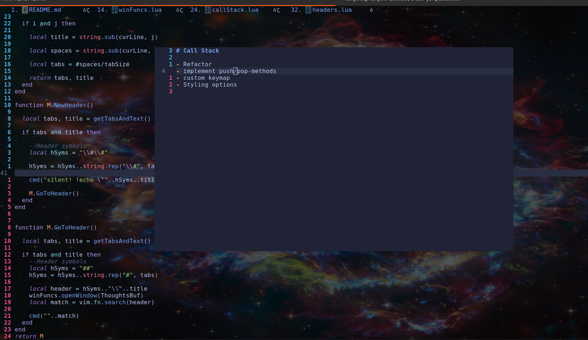
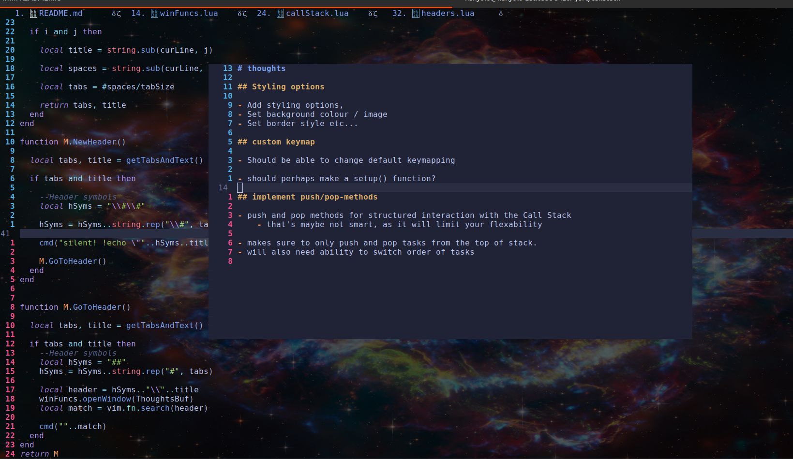

# CallStack

Nvim plugin for keeping track of tasks in a FIFO approach.

"push" and "pop" tasks to the call stack as you get done with them.
(Disclaimer: There are no push and pop methods, as it would be too restrictive )

If you need to take some extra notes correlated to a task. Do so by making a corresponding header in **Thoughts.md** with \<nh\> and automatically jump to it.

## Keymaps

```lua
--Set keymap -----------------------
vim.keymap.set("n", "]c", function ()
  winFuncs.openWindow(CSBuf) -- Open CallStack window
end)
vim.keymap.set("n", "[c",function ()
  winFuncs.closeWindow() -- Close current window
end)

vim.keymap.set("n", "]t", function()
  winFuncs.openWindow(ThoughtsBuf) --Open Thoughts window
end)

vim.keymap.set("n", "nh", function()
  headers.NewHeader() -- Make new header for stack element
end)

vim.keymap.set("n", "]h", function()
  headers.GoToHeader() -- Go to header under cursor
end)

```


## Images

### call stack



### Thoughts



